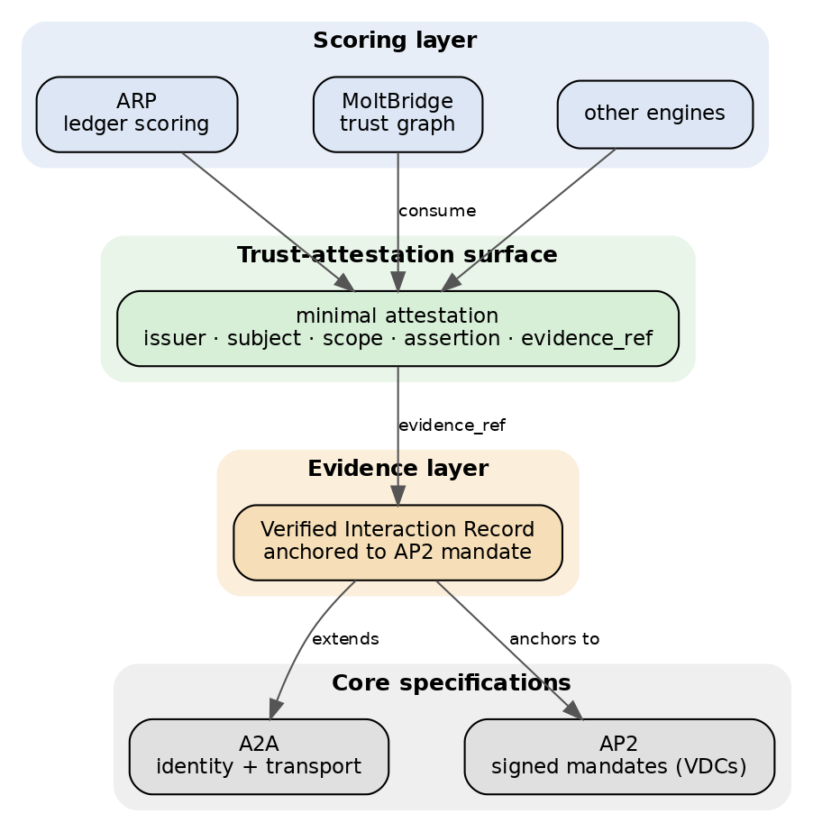

# Provenance-Anchored Reputation: Grounding Agent Reputation in Real, Completed Payments

**Ravi Kiran Kadaboina** · Independent Researcher

DOI: [10.5281/zenodo.20712592](https://doi.org/10.5281/zenodo.20712592)

## Abstract

AI agents increasingly transact on behalf of their users, and an agent must often
judge whether a counterparty is trustworthy before committing to an interaction.
Reputation systems address this problem for human marketplaces, and several recent
proposals extend reputation to agents. These proposals share a common weakness: the
evidence that an interaction occurred is self-issued by the interacting agents, so a
single operator that controls both sides can fabricate it. We propose to make this
evidence costly to fabricate by anchoring each reputation record to an artifact that a
genuine payment already produces, namely a settlement receipt signed by the buyer, the
merchant, and the payment network. Under this construction, fabricating a record
requires executing a real, paid transaction. We introduce Provenance-Anchored
Reputation (PAR), a compact record format with an open-source reference implementation,
built on the established Agent-to-Agent (A2A) and Agent Payments Protocol (AP2)
standards. PAR supplies verifiable evidence of interaction; the separate task of
converting that evidence into a score is delegated to dedicated scoring systems.

## 1. Introduction

Agents now discover one another, negotiate tasks, and settle payments through shared
protocols. A2A enables agents to describe their capabilities and communicate, and AP2
enables an agent to pay using a signed authorization from its user [1, 2]. These
protocols establish *who* an agent is and *that* it is authorized to pay; they say
nothing about *how well* an agent has performed in the past. This omission is
consequential, because a buyer's agent must choose among competing sellers and a seller
must decide which buyers to accept.

The same gap is the subject of an open design discussion in the A2A project
(Discussion #1631), which proposes a shared extension for agents to publish trust
signals, each referencing some underlying record of interaction [3]. The discussion
leaves the nature of that record unspecified. In the proposals advanced to date,
including the Agent Reputation Protocol (ARP) prototype [4], the record is self-issued
by the interacting parties, either as a row appended to a local ledger or as an
attestation jointly signed by both agents. Such records are forgeable by a single
operator that controls both the buyer and the seller, which can synthesize an arbitrary
interaction history at negligible cost. As participants in the discussion observe,
resisting this attack requires evidence that an agent cannot unilaterally assert about
itself.

## 2. Approach: reputation evidence as a costly signal

Our approach rests on a well-established principle: a signal is credible when it is
costly to fake. The same principle explains why an educational credential signals
ability in labor markets [5], why a costly biological display signals fitness [6], and
why an online review marked "verified purchase" carries more weight than an anonymous
one [7], since each is backed by a real, paid transaction.

A reputation record should therefore be expensive to produce. The least costly source
of such a record is one that a genuine payment already generates. When two parties
settle a payment on a modern rail, the resulting receipt is co-signed by parties that
do not trust one another (the user, the merchant, and the payment network) and cannot
be produced without an actual transfer of funds. Rather than defining a new proof of
interaction, we anchor each reputation record to this existing, multi-party-signed
receipt. Because fabricating a record then requires a real, paid transaction, the cost
of manufacturing fraudulent reputation approaches the cost of earning legitimate
reputation.

## 3. The Verified Interaction Record

The unit of PAR is a *Verified Interaction Record* (VIR). A VIR asserts that two
agents, A and B, interacted in defined roles, with A as the service provider and B as
the buyer, and a stated outcome, and it references the signed payment receipt for that
transaction. Issuing a VIR requires possession of such a receipt, which entails that a
real payment occurred.

A VIR comprises four components.

- **Anchor.** A reference to the signed payment receipt together with a verifiable
  fingerprint (a content hash) of it. The receipt must separate *what was purchased*
  from *how it was paid*. AP2's Checkout Mandate is the first such receipt; a
  card-network receipt or a bank-transfer confirmation would serve equivalently.
- **Parties.** The two agents, each identified by a durable identity (for example, a
  decentralized identifier) rather than a short-lived process. Reputation therefore
  accrues to the operator behind the agent: a negative record cannot be discarded by
  creating a new agent, and it is never bound to the human customer.
- **Interaction class.** A short label for the task (for example, "flight booking"), so
  that a record concerning one capability is not misread as evidence about another.
- **Outcome.** Whether the payment settled, and whether it was subsequently reversed.

A VIR carries only item-level facts (what was purchased, and from whom); it never
contains payment-instrument data or the customer's personal information. This separation
follows directly from the receipt's own split between the purchase and the payment.

Outcomes are interpreted with a single distinction. A payment reversed through a dispute
(a chargeback) indicates that the interaction did not succeed, and the corresponding
record is invalidated. A refund is treated differently: the interaction took place and
was undone by mutual agreement, which is frequently a sign of good conduct by the
seller, so the record remains valid evidence.

## 4. Reference implementation

We provide an open-source reference implementation comprising the record format, the
validation rules that enforce its invariants, and the procedure that derives a VIR from
a genuine AP2 receipt. The validators enforce that a record references a real, signed
receipt; that it names durable operator identities; that it contains no payment or
personal data; that the two agents occupy opposite roles; and that a reversed payment
invalidates the record. A bounded formal model in TLA+ mechanically checks the most
important of these invariants. The implementation, the model, and the A2A extension
format are publicly available.[^impl]

[^impl]: Reference implementation: <https://github.com/ravikiran438/par-reputation> (Apache-2.0).

## 5. Position in the stack and related work

PAR occupies a single layer within a larger stack (Figure 1). Beneath it, the core
standards (A2A and AP2) supply identity and signed payments. PAR sits directly above
them and converts a settled payment into an item of reputation evidence. Above PAR,
independent scoring systems determine how to aggregate many records into a score: how
to weight recent behavior, how to detect adversarial activity, and how to combine
signals. These design choices are varied and contested, and we deliberately do not
commit to any one of them; PAR's role is confined to making the evidence beneath those
scores trustworthy.

This also defines PAR's relationship to the A2A trust discussion: it is a concrete
answer to that discussion's open question of what a trust signal should reference. The
closest existing construction is ERC-8004, which likewise restricts feedback to paying
customers but records it on a blockchain and on a bare payment proof [8]. PAR requires
no blockchain and preserves the full purchase context behind each record.

*Figure 1. Where PAR sits. The core standards provide identity and signed payments; PAR
turns a settled payment into a reputation record; separate scoring systems sit on top.*

## 6. Scope and limitations

PAR raises the cost of fabricating reputation; it does not render fabrication
impossible. An adversary willing to execute real, paid transactions can still
accumulate standing, which is the intended outcome, since at that point the adversary
incurs roughly the cost borne by an honest seller. Detecting collusion distributed
across many accounts, and converting records into scores, are responsibilities of the
scoring layer above PAR rather than of the evidence layer itself. Finally, PAR depends
on a payment rail that issues receipts with the required structure; AP2 is the first
such rail, and we anticipate others.

## 7. Conclusion

The contribution is deliberately narrow. Rather than defining a new proof that two
agents interacted, PAR reuses the signed receipt that a genuine payment already
produces, rendering a reputation record costly to fabricate. The result is a thin,
off-chain evidence layer for agent reputation, built entirely on existing standards and
accompanied by a working reference implementation. The harder and more plural problem of
scoring is left to the systems designed for it.

## References

1. Google. *Agent Payments Protocol (AP2) Documentation.* 2026. <https://ap2-protocol.org/>
2. A2A Project. *Agent2Agent (A2A) Protocol.* 2026. <https://a2a-protocol.org/>
3. A2A community discussion (makito20256 and others). *Reputation-Aware Agent Discovery: A Trust Extension for A2A.* A2A Project GitHub Discussion #1631, 2026. <https://github.com/a2aproject/A2A/discussions/1631>
4. makito20256. *Agent Reputation Protocol (ARP).* 2026. <https://github.com/makito20256/arp-trust-substrate>
5. Spence, M. *Job Market Signaling.* The Quarterly Journal of Economics, 87(3):355–374, 1973.
6. Zahavi, A. *Mate Selection: A Selection for a Handicap.* Journal of Theoretical Biology, 53(1):205–214, 1975.
7. Resnick, P. and Zeckhauser, R. *Trust Among Strangers in Internet Transactions: Empirical Analysis of eBay's Reputation System.* In The Economics of the Internet and E-Commerce, Advances in Applied Microeconomics, vol. 11, pp. 127–157, 2002.
8. Ethereum Improvement Proposals. *ERC-8004: Trustless Agents.* 2026. <https://eips.ethereum.org/EIPS/eip-8004>
